# 第十一章 常见蜜罐体验和探索实验报告
## 1.实验环境搭建过程
### 1.1VMware网络环境配置
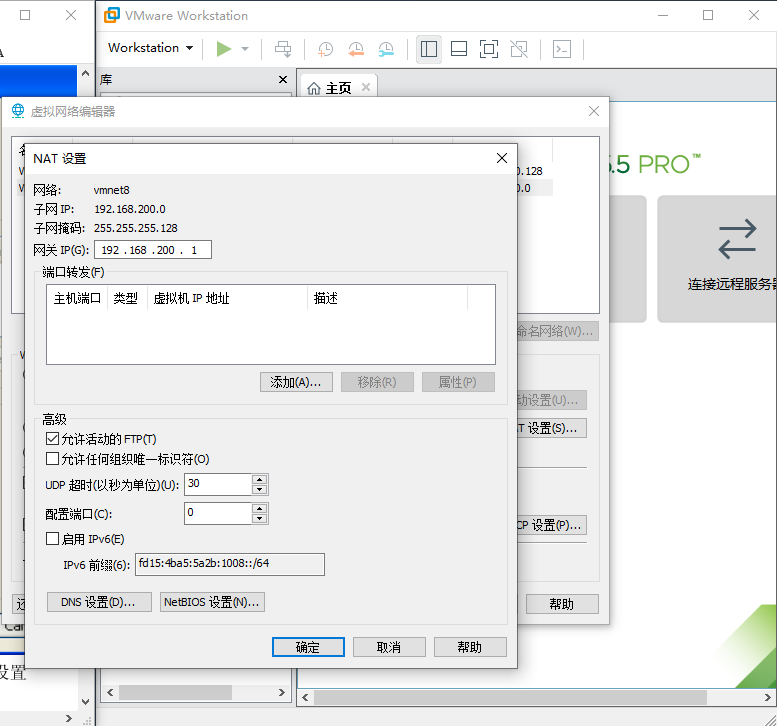
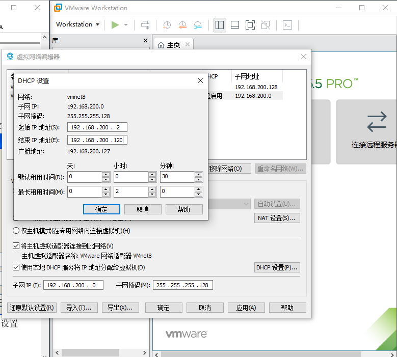
### 1.2攻击机配置
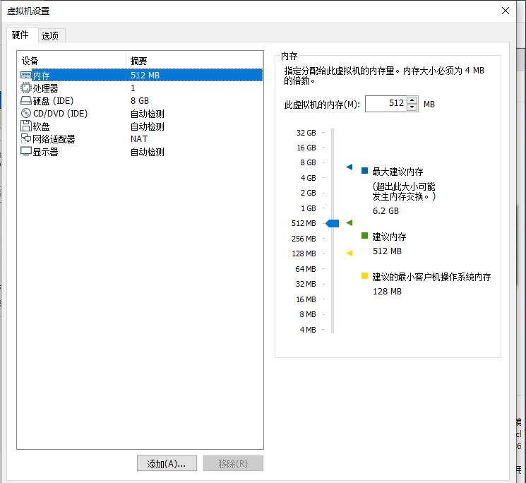
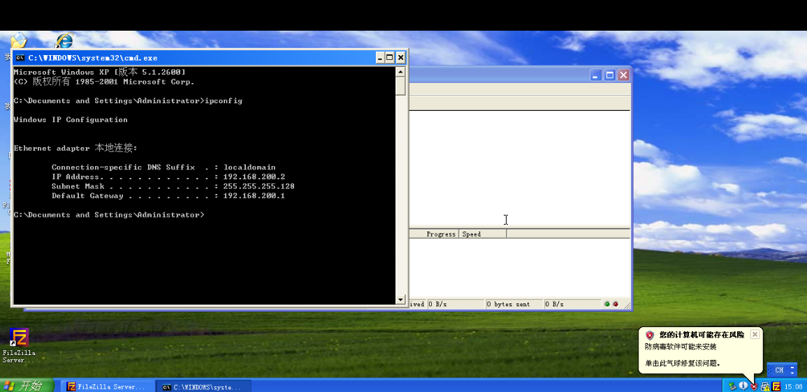
### 1.3靶机配置
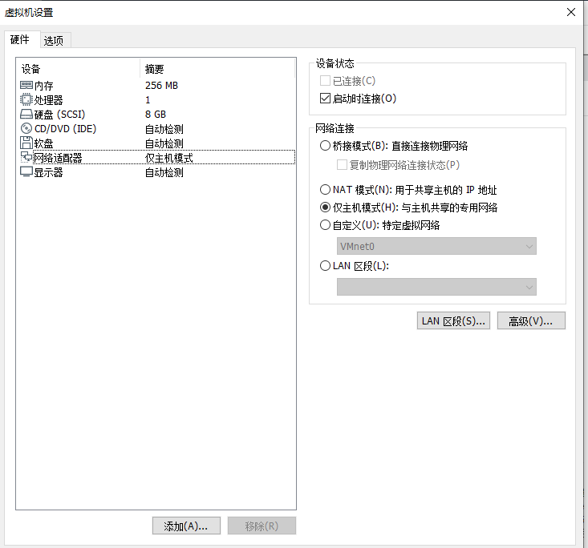

### 1.4安装蜜网网关虚拟机
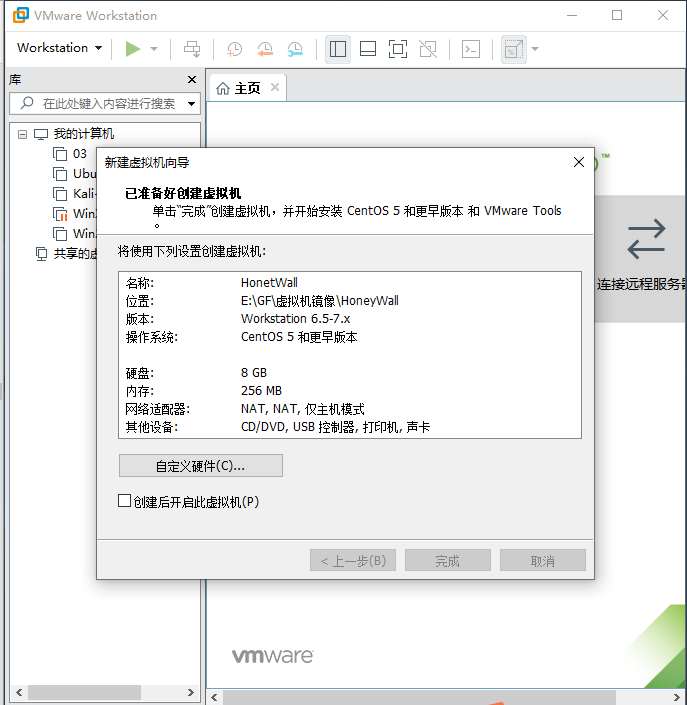
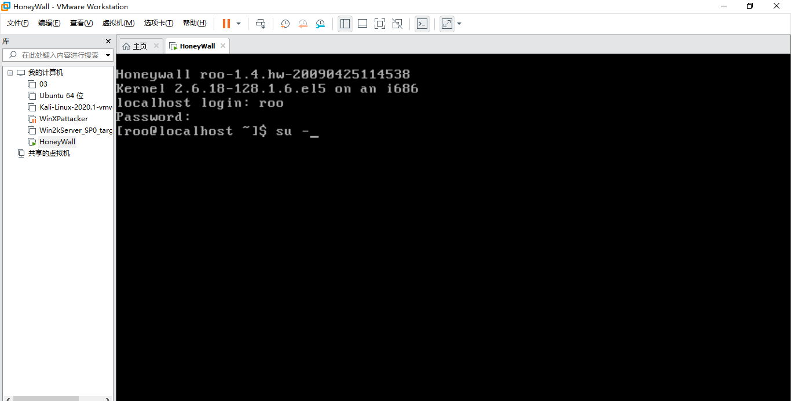

### 1.5蜜网网关管理配置
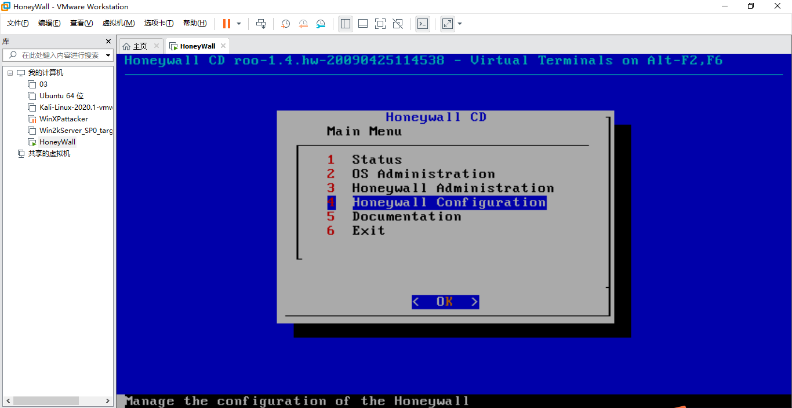
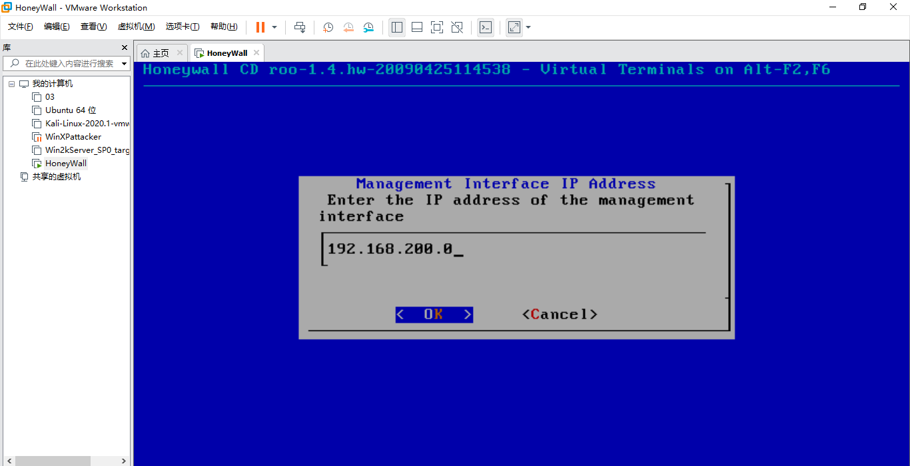
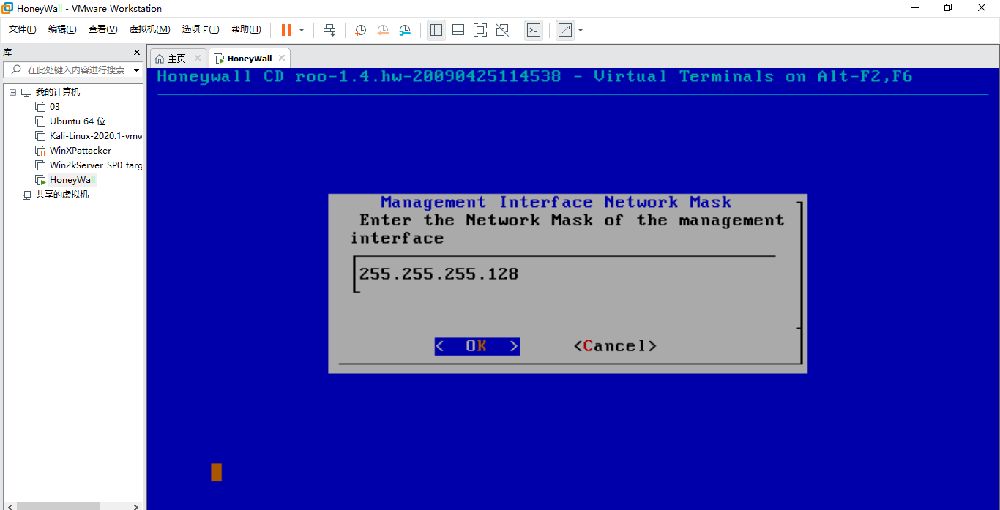
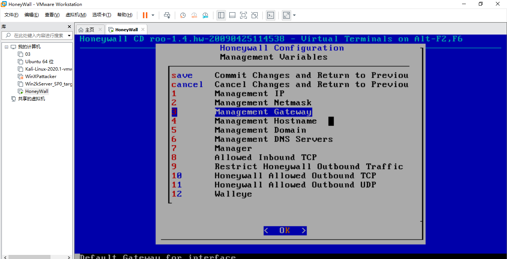

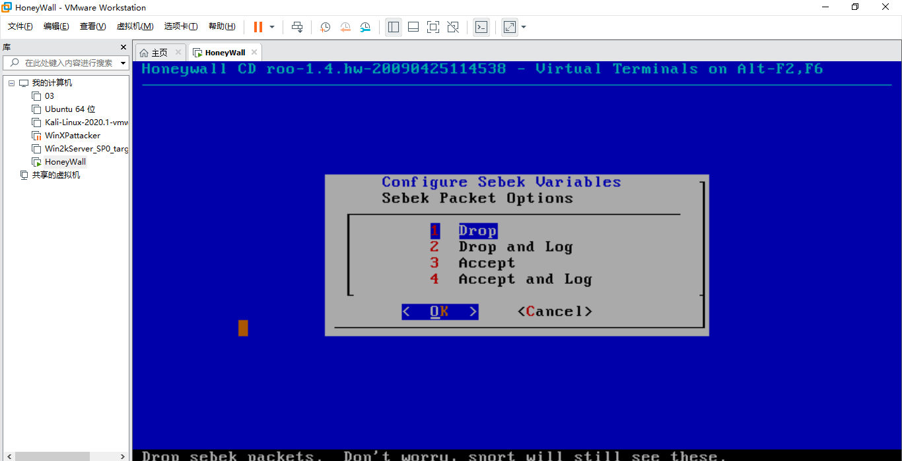
### 1.6测试网络连接
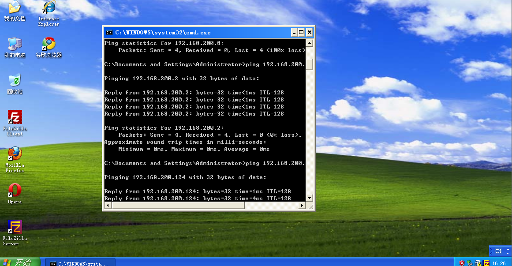
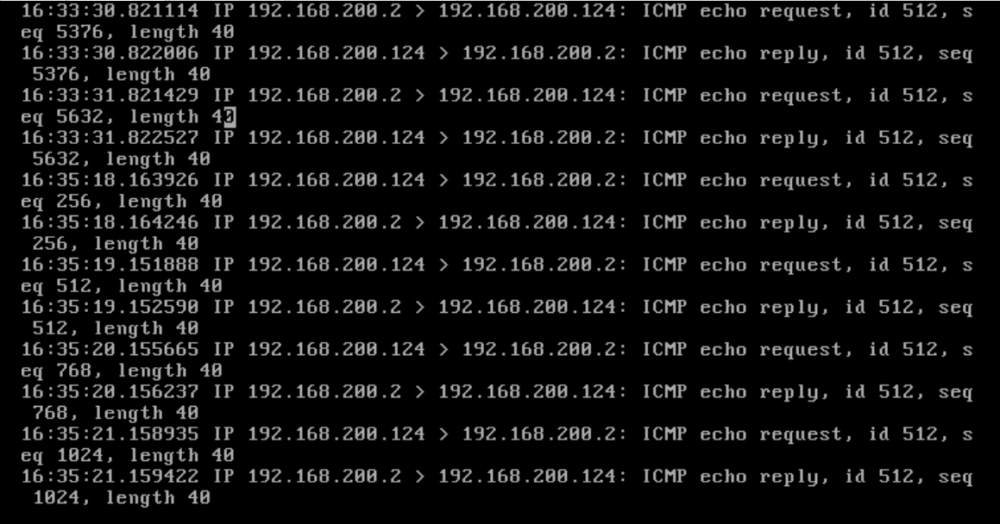

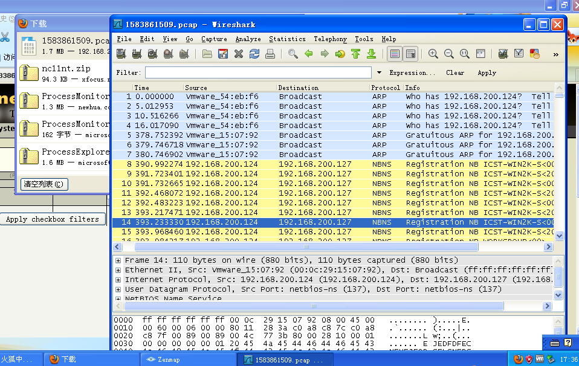
### 1.7解压缩SEEDUbuntu，在虚拟机打开
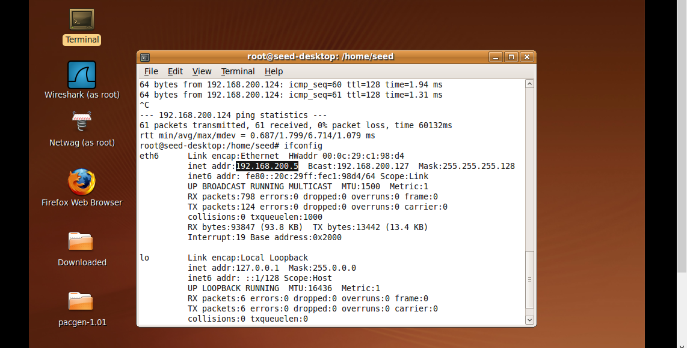
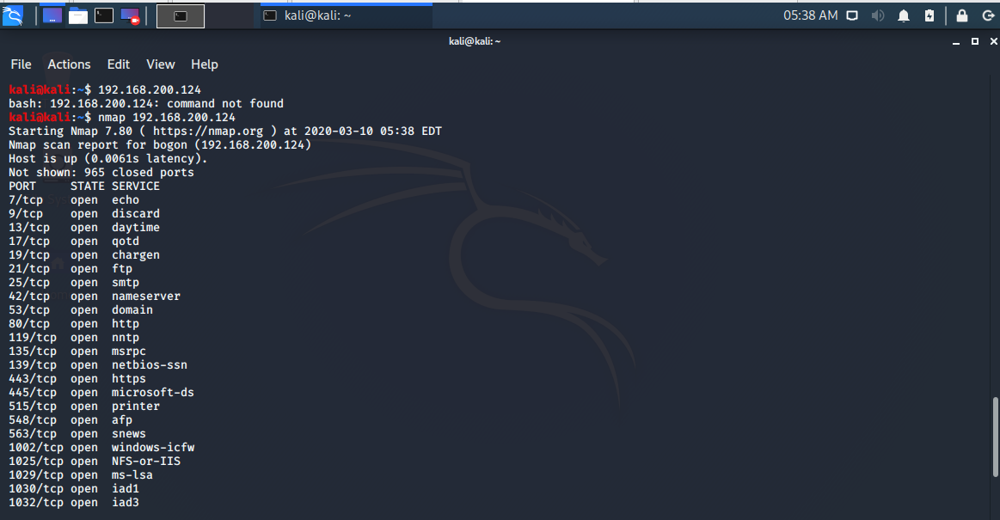
### 1.8渗透攻击测试

## 2.问题与解决
### 问题1：在安装蜜网网关虚拟机时，按照教程把iso文件直接放入，结果由于版本较早会执行简易安装，之后会遇到无法安装蜜网网关软件问题
#### 解决：新建虚拟机时，不直接放入iso文件，而是在虚拟机安装完成之后在设置中加入iso文件，不仅安装完整，并且直接出现安装蜜网网关软件，不用输入命令调出安装软件界面。
### 问题2：2020版本的kali，在终端输入apt-get update && upgrade会碰到错误
#### 解决：2020版本的kali对于以往版本用户来说比较坑，直接下载vm文件时，默认用户密码为kali\kali，不是root账户，需要sudo passwd root命令设置root密码(用惯了root，会忽略，困惑了一会儿，之后才发现没root)，登录为root权限时，apt-get update && upgrade不会再报错，kali官方源比较慢，因此一般会换软件源，通过vim /etc/apt/sources.list更换软件源，之后再更新会加快速度。
### 问题3：远程管理蜜网网关时，显示不清
#### 解决：怀疑是没有安装sebek导致，因此在csdn找到sebek下载到本地，由于windows靶机安装vmtools出错，因此选择共享文件夹形式将sebek拷贝到虚拟机
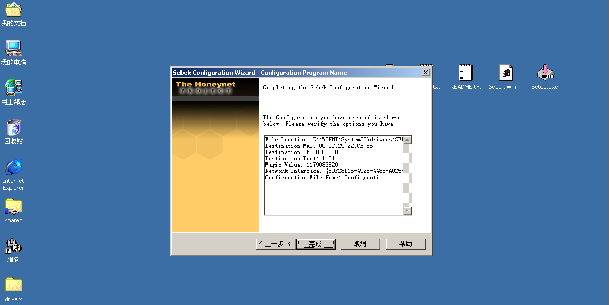
## 3.总结
### 一个基础的网络攻防实验环境至少需要：
#### a.靶机：包含系统和应用程序安全漏洞，并作为攻击目标的主机。
#### b.攻击机：安装一些专用的攻击软件，用于发起网络攻击的主机。Linux更适合作为攻击机平台。
#### c.攻击监测、分析和防御平台：最佳位置是靶机的网关，可以基于Linux操作系统构建网关主机，并通过集成各种软件使其具备网络攻击监测、分析与防御的功能。
#### d.网络连接：通过网络将靶机、攻击机和具备检测分析防御功能的网关进行连接。
### 密网：通过构建部署陷阱网络进行诱骗与分析网络攻击的一种技术手段。
### 密网网关：透明网关的攻击行为捕获与分析平台，并在蜜罐主机上通过Sebek软件记录系统攻击行为。
### 虚拟密网：蜜网架构基于虚拟机技术在单一主机上进行部署。在陷阱网络中部署靶机作为攻击目标，利用密网网关作为网络攻击监测、分析与防御平台，并在网关外网口虚拟攻击网段和攻击机，从而构成个人版的虚拟化网络攻防实验环境。